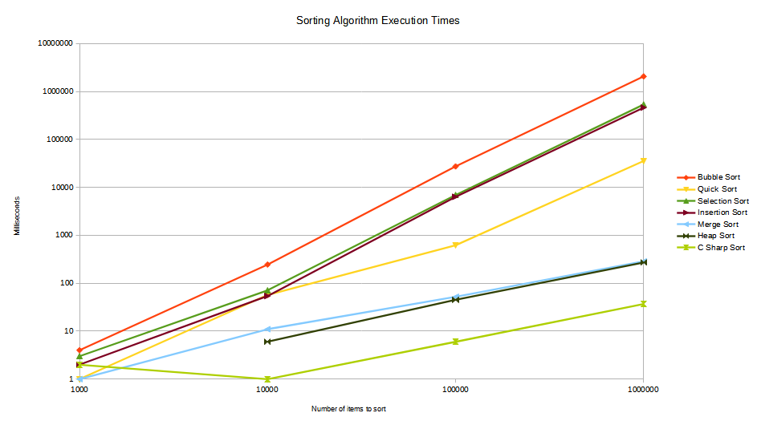

# Sorting Algorithms

## Description
A project that implements different sorting algorithms in C# and uses them to sort an array of randomly generated numbers.

Each algorithm is timed and a summary is displayed after all sorting algorithms have completed sorting.

## Usage
At the command line type:

`SortingAlgorithms.exe <size_of_array>`

If the size_of_array argument is not entered the array size defaults to 1000.

## Findings
The results of running each sorting algorithm with different array sizes:

### Number of items to sort: 1000
Algorithm: Bubble Sort, Time: 4ms  
Algorithm: Quick Sort, Time: 1ms  
Algorithm: Selection Sort, Time: 3ms  
Algorithm: Insertion Sort, Time: 2ms  
Algorithm: Merge Sort, Time: 1ms  
Algorithm: Heap Sort, Time: 0ms  
Algorithm: C Sharp Sort, Time: 2ms

### Number of items to sort: 10,000
Algorithm: Bubble Sort, Time: 245ms  
Algorithm: Quick Sort, Time: 57ms  
Algorithm: Selection Sort, Time: 71ms  
Algorithm: Insertion Sort, Time: 54ms  
Algorithm: Merge Sort, Time: 11ms  
Algorithm: Heap Sort, Time: 6ms  
Algorithm: C Sharp Sort, Time: 1ms

### Number of items to sort: 100,000
Algorithm: Bubble Sort, Time: 27324ms  
Algorithm: Quick Sort, Time: 617ms  
Algorithm: Selection Sort, Time: 6915ms  
Algorithm: Insertion Sort, Time: 6343ms  
Algorithm: Merge Sort, Time: 52ms  
Algorithm: Heap Sort, Time: 45ms  
Algorithm: C Sharp Sort, Time: 6ms

### Number of items to sort: 1000,000
Algorithm: Bubble Sort, Time: 2058459ms  
Algorithm: Quick Sort, Time: 35380ms  
Algorithm: Selection Sort, Time: 533023ms  
Algorithm: Insertion Sort, Time: 460394ms  
Algorithm: Merge Sort, Time: 285ms  
Algorithm: Heap Sort, Time: 271ms  
Algorithm: C Sharp Sort, Time: 37ms

## Conclusion
This project implemented several sorting algorithms and compared their execution times.  The implemented sorting algorithms were also compared to the built in Array.Sort() in C#.

Overall the built in sort in C# performed the best.  This could be due to it's implementation of using three sorting algorithms and selecting either Insertion Sort if the array is 16 items or less, Heap Sort if the number of partitions exceeds 2 * Log^N, or Quicksort.  [See Microsoft documentation for further details](https://learn.microsoft.com/en-us/dotnet/api/system.array.sort?view=net-8.0#system-array-sort(system-array)).  There will also be optimisations that the team at Microsoft has implemented.

In short it is best for most cases to use the built in sort function that comes with C#.